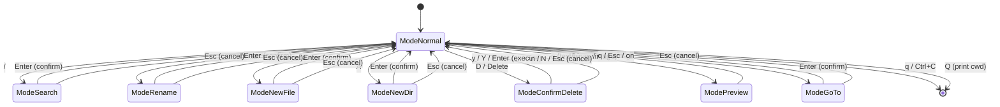

# Architecture Details

## State Machine

InputMode 状態遷移図



## States

| State | Description |
|-------|-------------|
| ModeNormal | デフォルト状態。ナビゲーション・ファイル操作 |
| ModeSearch | 検索入力中 |
| ModeRename | リネーム入力中 |
| ModeNewFile | 新規ファイル名入力中 |
| ModeNewDir | 新規ディレクトリ名入力中 |
| ModeConfirmDelete | 削除確認ダイアログ |
| ModePreview | ファイルプレビュー表示中（テキスト/バイナリ/画像） |
| ModeGoTo | パス入力中（ディレクトリ移動） |

## Transitions

### ModeNormal からの遷移
- `/` → ModeSearch
- `r` → ModeRename
- `a` → ModeNewFile
- `A` → ModeNewDir
- `D` or `Delete` → ModeConfirmDelete
- `o` → ModePreview
- `gn` → ModeGoTo
- `q` or `Ctrl+C` → 終了
- `Q` → 終了 + cwd出力（シェル連携用）

### ModeNormal への遷移
- 入力モード: `Enter` (確定) or `Esc` (キャンセル)
- 削除確認: `y/Y/Enter` (実行) or `n/N/Esc` (キャンセル)
- プレビュー: `q/Esc/o`
- GoTo: `Enter` (確定) or `Esc` (キャンセル)

## Directory Navigation (netrw-style)

| キー | 動作 |
|------|------|
| `-` | 親ディレクトリへ移動 |
| `~` | ホームディレクトリへ移動 |
| `gn` | パス入力モード（任意のパスへ移動） |
| `gg` | ツリー先頭へ（vim標準） |
| `Q` | 終了 + 現在のルートをstdoutに出力 |

### シェル連携

`Q`で終了時にルートパスを出力。シェル関数でcdに連携：

```bash
# ~/.zshrc or ~/.bashrc
bon3cd() {
    local dir
    dir=$(bon3 "$@")
    if [[ -n "$dir" && -d "$dir" ]]; then
        cd "$dir"
    fi
}
```

## Preview Mode

| 種類 | 判定条件 | 表示方法 | 終了時の処理 |
|------|---------|---------|-------------|
| テキスト | バイナリでも画像でもない | 行番号付きテキスト | なし |
| バイナリ | null文字または非印字文字30%超 | HEXダンプ (16bytes/行) | なし |
| 画像 | 拡張子が画像形式 | chafa優先、なければASCIIアート | chafaの場合のみKitty画像削除シーケンス送信 |

**対応画像形式**: PNG, JPG, JPEG, GIF, BMP, WebP, TIFF, TIF, ICO

**実装** (`update.go`):
- `isImageFile()`: 拡張子判定
- `getImageInfo()`: 画像メタデータ取得（幅、高さ、フォーマット、サイズ）
- `loadImagePreview()`: chafa優先、image2asciiフォールバック
- `clearKittyImages()`: `\x1b_Ga=d,d=A\x1b\\` 送信

### 画像情報表示

タイトルバーに画像メタデータを表示:
```
 image.png (1920×1080 PNG, 2.4MB)
```

**表示項目**:
- ファイル名
- 幅 × 高さ (px)
- フォーマット (PNG/JPEG/GIF等)
- ファイルサイズ

**実装** (`view.go`):
- `renderPreview()`: タイトル生成時に `m.imageWidth`, `m.imageHeight`, `m.imageFormat`, `m.imageSize` を使用
- `formatFileSize()`: バイト数を人間可読形式に変換 (KB/MB/GB)

### Preview キーバインド
| キー | 動作 |
|------|------|
| `j` / `↓` | 1行下スクロール |
| `k` / `↑` | 1行上スクロール |
| `f` / `Space` / `PageDown` | ページダウン |
| `b` / `PageUp` | ページアップ |
| `g` | 先頭へジャンプ |
| `G` | 末尾へジャンプ |
| `q` / `Esc` / `o` | プレビュー終了 |

## VCS Integration

インターフェースパターンで抽象化:
- **gitstatus.go**: `git status --porcelain`
- **jjstatus.go**: `jj status` / `jj log`

親ディレクトリへステータス伝播。

## Drag & Drop

- **drop.go**: ターミナルペーストイベントをファイルドロップとして処理

## File Watching

- **watcher.go**: fsnotifyによるリアルタイム監視
  - 200msデバウンス
  - Chmodイベント無視（Spotlight等）
  - 展開ディレクトリのみ監視
  - `W`キーでトグル（無効時は完全解放）

## Performance

- VCS更新は同期実行（シンプルさ優先）
- Watcher無効時はリソース完全解放
- `.git`/`.jj`ディレクトリ監視でコミット検知
