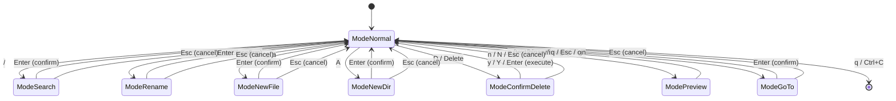

# Architecture Details

## State Machine

InputMode 状態遷移図



## States

| State | Description |
|-------|-------------|
| ModeNormal | デフォルト状態。ナビゲーション・ファイル操作 |
| ModeSearch | 検索入力中 |
| ModeRename | リネーム入力中 |
| ModeNewFile | 新規ファイル名入力中 |
| ModeNewDir | 新規ディレクトリ名入力中 |
| ModeConfirmDelete | 削除確認ダイアログ |
| ModePreview | ファイルプレビュー表示中（テキスト/バイナリ/画像） |
| ModeGoTo | パス入力中（ディレクトリ移動） |

## Transitions

### ModeNormal からの遷移
- `/` → ModeSearch
- `r` → ModeRename
- `a` → ModeNewFile
- `A` → ModeNewDir
- `D` or `Delete` → ModeConfirmDelete
- `o` → ModePreview
- `gn` → ModeGoTo
- `q` or `Ctrl+C` → 終了

### ModeNormal への遷移
- 入力モード: `Enter` (確定) or `Esc` (キャンセル)
- 削除確認: `y/Y/Enter` (実行) or `n/N/Esc` (キャンセル)
- プレビュー: `q/Esc/o`
- GoTo: `Enter` (確定) or `Esc` (キャンセル)

## Directory Navigation

| キー | 動作 |
|------|------|
| `gn` | パス入力モード（`~`や`..`も対応） |
| `gg` | ツリー先頭へ（vim標準） |

### Tab補完 (ModeGoTo)

ターミナルスタイルのパス補完機能。

| キー | 動作 |
|------|------|
| `Tab` | 補完実行 / 次の候補（入力欄も更新） |
| `Shift+Tab` | 前の候補（入力欄も更新） |
| `↓` / `Ctrl+n` | 次の候補（選択のみ） |
| `↑` / `Ctrl+p` | 前の候補（選択のみ） |
| `Enter` | 確定（選択中の候補を適用） |
| `Esc` | キャンセル |
| 文字入力 | 候補を絞り込み |

**補完ロジック**:
1. 1件のみマッチ → 自動補完
2. 複数マッチ → 共通プレフィックス補完 + 候補表示
3. Tab連打 → 候補を順番に選択（入力欄も更新）
4. 矢印/Ctrl+n/p → 候補を選択（入力欄は更新せず、Enterで確定）
5. 文字入力 → 候補をリアルタイム絞り込み

**実装** (`completion.go`):
- `getCompletions(input, baseDir)`: マッチするエントリと共通プレフィックスを返す
- `findCommonPrefix(paths)`: 共通プレフィックス計算
- `collapseHomePath(path)`: `~`表示用に変換

**State Fields** (`model.go`):
- `completionCandidates []string`: 補完候補リスト
- `completionIndex int`: 選択中の候補 (-1 = 未選択)

**表示** (`view.go`):
- 最大5件表示
- 選択中の候補をハイライト
- 超過分は「... +N more」表示

## Preview Mode

| 種類 | 判定条件 | 表示方法 | 終了時の処理 |
|------|---------|---------|-------------|
| テキスト | バイナリでも画像でもない | 行番号付きテキスト | なし |
| バイナリ | null文字または非印字文字30%超 | HEXダンプ (16bytes/行) | なし |
| 画像 | 拡張子が画像形式 | chafa優先、なければASCIIアート | chafaの場合のみKitty画像削除シーケンス送信 |

**対応画像形式**: PNG, JPG, JPEG, GIF, BMP, WebP, TIFF, TIF, ICO

**実装** (`update.go`):
- `isImageFile()`: 拡張子判定
- `getImageInfo()`: 画像メタデータ取得（幅、高さ、フォーマット、サイズ）
- `loadImagePreview()`: chafa優先、image2asciiフォールバック
- `clearKittyImages()`: `\x1b_Ga=d,d=A\x1b\\` 送信

### 画像情報表示

タイトルバーに画像メタデータを表示:
```
 image.png (1920×1080 PNG, 2.4MB)
```

**表示項目**:
- ファイル名
- 幅 × 高さ (px)
- フォーマット (PNG/JPEG/GIF等)
- ファイルサイズ

**実装** (`view.go`):
- `renderPreview()`: タイトル生成時に `m.imageWidth`, `m.imageHeight`, `m.imageFormat`, `m.imageSize` を使用
- `formatFileSize()`: バイト数を人間可読形式に変換 (KB/MB/GB)

### Preview キーバインド
| キー | 動作 |
|------|------|
| `j` / `↓` | 1行下スクロール |
| `k` / `↑` | 1行上スクロール |
| `f` / `Space` / `PageDown` | ページダウン |
| `b` / `PageUp` | ページアップ |
| `g` | 先頭へジャンプ |
| `G` | 末尾へジャンプ |
| `n` | 次の変更行へジャンプ |
| `N` | 前の変更行へジャンプ |
| `q` / `Esc` / `o` | プレビュー終了 |

### Preview Diff 表示

未コミット変更行をハイライト表示し、n/N でジャンプ可能。

**マーカー表示**:
- `+ ` (緑): 追加行
- `~ ` (黄): 変更行

**インジケータ**: `[2/5 changes]` - 現在位置/総変更数

**実装** (`vcs.go`, `gitstatus.go`, `jjstatus.go`):
- `GetFileDiff(path)`: 未コミット変更行を取得
- `parseGitDiff()`: Git unified diff 解析

**State Fields** (`model.go`):
- `previewDiffLines []DiffLine`: 変更行リスト
- `previewDiffMap map[int]DiffLine`: 行番号→変更タイプ
- `previewDiffIndex int`: 現在選択中の変更 (-1 = 未選択)

## VCS Integration

インターフェースパターンで抽象化:
- **gitstatus.go**: `git status --porcelain`
- **jjstatus.go**: `jj status` / `jj log`

親ディレクトリへステータス伝播。

## Drag & Drop

- **drop.go**: ターミナルペーストイベントをファイルドロップとして処理

## File Watching

- **watcher.go**: fsnotifyによるリアルタイム監視
  - 200msデバウンス
  - Chmodイベント無視（Spotlight等）
  - 展開ディレクトリのみ監視
  - `W`キーでトグル（無効時は完全解放）

## Performance

- VCS更新は同期実行（シンプルさ優先）
- Watcher無効時はリソース完全解放
- `.git`/`.jj`ディレクトリ監視でコミット検知
