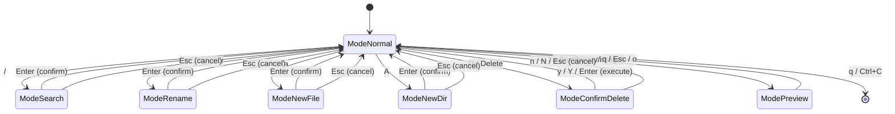

# State Machine

bon3ai の InputMode 状態遷移図

## States

| State | Description |
|-------|-------------|
| ModeNormal | デフォルト状態。ナビゲーション・ファイル操作 |
| ModeSearch | 検索入力中 |
| ModeRename | リネーム入力中 |
| ModeNewFile | 新規ファイル名入力中 |
| ModeNewDir | 新規ディレクトリ名入力中 |
| ModeConfirmDelete | 削除確認ダイアログ |
| ModePreview | ファイルプレビュー表示中（テキスト/バイナリ/画像） |

## Transitions

### ModeNormal からの遷移
- `/` → ModeSearch
- `r` → ModeRename
- `a` → ModeNewFile
- `A` → ModeNewDir
- `D` or `Delete` → ModeConfirmDelete
- `o` → ModePreview
- `q` or `Ctrl+C` → 終了

### ModeNormal への遷移
- 入力モード: `Enter` (確定) or `Esc` (キャンセル)
- 削除確認: `y/Y/Enter` (実行) or `n/N/Esc` (キャンセル)
- プレビュー: `q/Esc/o`

## Preview Mode Details

ModePreview はファイルの種類によって3つの表示モードがある:

| 種類 | 判定条件 | 表示方法 | 終了時の処理 |
|------|---------|---------|-------------|
| テキスト | バイナリでも画像でもない | 行番号付きテキスト | なし |
| バイナリ | null文字または非印字文字30%超 | HEXダンプ (16bytes/行) | なし |
| 画像 | 拡張子が画像形式 | chafa優先、なければASCIIアート | chafaの場合のみKitty画像削除シーケンス送信 |

### 画像プレビューの動作

1. **chafaがインストールされている場合**: Kittyプロトコルで高品質表示
2. **chafaがインストールされていない場合**: image2asciiによるASCIIアートでフォールバック表示

### 対応画像形式
PNG, JPG, JPEG, GIF, BMP, WebP, TIFF, TIF, ICO

### Preview Mode キーバインド
| キー | 動作 |
|------|------|
| `j` / `↓` | 1行下スクロール |
| `k` / `↑` | 1行上スクロール |
| `f` / `Space` / `PageDown` | ページダウン |
| `b` / `PageUp` | ページアップ |
| `g` | 先頭へジャンプ |
| `G` | 末尾へジャンプ |
| `q` / `Esc` / `o` | プレビュー終了 |
