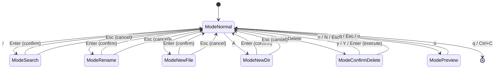

# State Machine

bon3ai の InputMode 状態遷移図

## States

| State | Description |
|-------|-------------|
| ModeNormal | デフォルト状態。ナビゲーション・ファイル操作 |
| ModeSearch | 検索入力中 |
| ModeRename | リネーム入力中 |
| ModeNewFile | 新規ファイル名入力中 |
| ModeNewDir | 新規ディレクトリ名入力中 |
| ModeConfirmDelete | 削除確認ダイアログ |
| ModePreview | ファイルプレビュー表示中 |

## Transitions

### ModeNormal からの遷移
- `/` → ModeSearch
- `r` → ModeRename
- `a` → ModeNewFile
- `A` → ModeNewDir
- `D` or `Delete` → ModeConfirmDelete
- `o` → ModePreview
- `q` or `Ctrl+C` → 終了

### ModeNormal への遷移
- 入力モード: `Enter` (確定) or `Esc` (キャンセル)
- 削除確認: `y/Y/Enter` (実行) or `n/N/Esc` (キャンセル)
- プレビュー: `q/Esc/o`
